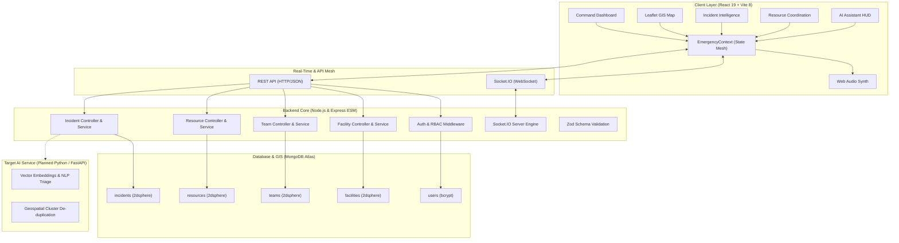

# PS-9 // EmergenX — Intelligent Emergency Response & Resource Coordination Platform

<div align="center">


<br/>

[](https://github.com)
[](https://react.dev/)
[](https://expressjs.com/)
[](https://fastapi.tiangolo.com/)
[](https://www.mongodb.com/)
[](https://socket.io/)
[](https://leafletjs.com/)
[](https://tailwindcss.com/)

<br/>

**Mission Control & Geospatial Command Center for Disaster Management Authorities, Emergency Operation Centers (EOC), Rescue Brigades, and First Responders.**

*Transforming fragmented, multi-source emergency telemetry into an intelligent, coordinated, real-time operational response.*

</div>

---

## ⚡ Evaluator Quick Read

| Dimension | PS-9 / EmergenX Operational Specification |
|:---|:---|
| **Problem Addressed** | Emergency information arrives fragmented across 911 calls, citizen apps, IoT sensors, drones, field radios, and hospitals—leading to duplicate confusion, unverified severity, resource allocation delays, and tragic response latency. |
| **Core Platform** | A defense-grade, unified emergency operations platform that fuses multi-source telemetry, executes AI-assisted incident triage & de-duplication, calculates optimal resource dispatch vectors, and coordinates field response in real time. |
| **AI Role & Boundary** | **Decision Support & Analysis** (NLP report extraction, confidence scoring, duplicate clustering, automated incident summaries, capability matching) while **Deterministic Rules** govern SLA thresholds, safety constraints, and priority matrices. **The human operator retains ultimate command.** |
| **Geospatial Intelligence** | Interactive Leaflet GIS with CartoDB Dark Matter telemetry overlays, `2dsphere` indexed coordinate querying, dynamic hazard radius perimeters, hospital bed saturation heatmaps, and field apparatus location tracking. |
| **Real-Time Architecture** | Low-latency Socket.IO event mesh (`incident:new`, `incident:updated`, `incident:statusChanged`) synchronizing command center displays, tactical maps, and field unit statuses with sub-second propagation. |
| **Resource Optimization** | Nearest-apparatus capability scoring matching incident requirements (e.g., industrial foam tender, burn trauma ICU, water rescue) against live unit availability, transit distance, and operational workload. |
| **Current Work (Mid-Eval)** | **Complete React 19 / Vite / Tailwind v4 Command Frontend** (13+ mission screens, dual simulation & live backend sync mode, Web Audio API tactical sound synthesis), **Production-style Node.js / Express REST API** with MongoDB schemas & `2dsphere` indexes, **Dedicated Python/FastAPI AI Microservice** (port 8000) for explainable incident classification and deterministic life-safety overrides (P1 mandatory escalation), realistic 22-incident seed dataset, and 46 automated Postman assertions. |
| **Next Phase** | Continuous vector embedding duplicate clustering, live speech-to-text 911 audio transcript ingestion, external live traffic navigation API routing (OSRM/Mapbox), and automated multi-agency mutual aid webhooks. |

---

## 📑 Table of Contents

- [🚨 The Problem We Solve](#-the-problem-we-solve)
- [🎯 What PS-9 Solves](#-what-ps-9-solves)
- [🧠 How the System Works](#-how-the-system-works)
- [🚧 Current Implementation Status](#-current-implementation-status)
- [🖥️ Operational Command Interface](#️-operational-command-interface)
- [🚨 End-to-End Emergency Workflow](#-end-to-end-emergency-workflow)
- [🤖 AI + Decision Support](#-ai--decision-support)
- [🚒 Intelligent Resource Coordination](#-intelligent-resource-coordination)
- [📡 Real-Time Emergency Monitoring](#-real-time-emergency-monitoring)
- [⚠️ Alerts & Escalation Engine](#️-alerts--escalation-engine)
- [📊 Emergency Analytics & Debrief](#-emergency-analytics--debrief)
- [🗂️ Data Strategy](#️-data-strategy)
- [🏗️ System Architecture](#️-system-architecture)
- [🛡️ Human-in-the-Loop Operations](#️-human-in-the-loop-operations)
- [🛠️ Development Roadmap](#️-development-roadmap)
- [🧪 Evaluation Demo Walkthrough](#-evaluation-demo-walkthrough)
- [⚙️ Technology Stack](#️-technology-stack)
- [📁 Project Structure](#-project-structure)
- [🚀 Getting Started](#-getting-started)
- [🔐 Environment Configuration](#-environment-configuration)
- [🔭 Future Scope](#-future-scope)

---

## 🚨 The Problem We Solve

During major urban disasters—such as industrial refinery fires, flash floods, multi-vehicle highway pileups, or hazardous chemical leaks—emergency operation centers face an **information breakdown**:

```text
Citizen Reports (Mobile App) ──┐
Emergency Phone Switchboard ───┤
IoT Acoustic & Thermal Sensors ┼──► [ FRAGMENTED, UNVERIFIED DATA ]
Surveillance Drones ───────────┤         │
Field Unit Radio Telemetry ────┤         ▼
Hospital Trauma Capacity ──────┘    Information Bottlenecks:
                                    • Unclear incident severity
                                    • 5–15 duplicate calls for 1 fire
                                    • Blind dispatch to wrong locations
                                    • Unknown hospital ICU saturation
                                    • Undetected response delays
```

### Critical Questions Every Emergency Coordinator Faces:

1. **What is happening and where?** Is a report of smoke on the highway related to an explosion 1 km away?
2. **How severe is it?** Does the incident involve toxic materials, trapped civilians, or structural collapse?
3. **Are multiple reports describing the same event?** How can operators avoid dispatching three separate crews to duplicate calls?
4. **Which teams and apparatus are eligible and available?** Does the nearest fire engine have industrial foam, or must a regional unit be mobilized?
5. **Which hospitals can accept critical casualties?** Are local trauma centers already at 100% capacity?
6. **Is the response delayed?** Has an assigned ambulance exceeded the 8-minute SLA without command notification?

---

## 🎯 What PS-9 Solves

PS-9 (**EmergenX**) creates a **unified operational command layer** that bridges fragmented inputs into coordinated operational outputs:

```text
 Citizen Report ──┐
 Emergency Call ──┤
 IoT Sensor ──────┼──► ┌────────────────────────────────────────────────┐
 Field Team Radio ┤    │              PS-9 EMERGENX CORE                │
 Drone Telemetry ─┤    │ • Multi-Source Ingestion & Reliability Scoring │
 Hospital Intake ─┘    │ • AI Natural Language Triage & De-duplication  │
                       │ • Geospatial 2dsphere Proximity & Blast Radius │
                       │ • Resource Capability Matching Engine          │
                       │ • Real-Time Socket.IO Mesh & Delay Escalation  │
                       └───────────────────────┬────────────────────────┘
                                               │
                                               ▼
                                ┌───────────────────────────────┐
                                │     COORDINATED RESPONSE      │
                                │ • Verified P1-P4 Incident     │
                                │ • Automated Apparatus Route   │
                                │ • Real-Time SLA Tracking      │
                                │ • Live Cross-Agency Picture   │
                                └───────────────────────────────┘
```

---

## 🧠 How the System Works

The platform operates across an unbroken **11-stage emergency lifecycle**:

```text
 [1. REPORT] ──► [2. UNDERSTAND] ──► [3. CONSOLIDATE] ──► [4. PRIORITIZE] ──► [5. RECOMMEND]
      ▲                                                                             │
      │                                                                             ▼
 [11. ANALYZE] ◄── [10. DEBRIEF] ◄── [9. ESCALATE] ◄── [8. MONITOR] ◄── [7. DISPATCH] ◄─┘
```

1. **INCIDENT COLLECTION**: Ingests raw inputs from emergency phone switchboards, citizen web reports, acoustic/thermal IoT nodes, and aerial drones into a unified queue.
2. **AI CLASSIFICATION**: NLP pipelines extract entities (chemical type, trapped persons, fire class) and classify incident categories with confidence metrics (e.g., 94% verified confidence).
3. **CONSOLIDATION & DE-DUPLICATION**: Clusters reports by geospatial proximity, time windows, and semantic similarity to prevent resource fragmentation.
4. **SEVERITY & PRIORITY ASSIGNMENT**: Deterministic risk matrices score hazards from **LOW** to **CRITICAL** and map operational priorities from **P1** (immediate threat to life) to **P4** (routine).
5. **RESOURCE RECOMMENDATION**: Multi-criteria matching evaluates unit availability, distance via geospatial indexing, vehicle apparatus (e.g., hazmat, heavy rescue), and hospital bed capacity.
6. **COORDINATION & DISPATCH**: Operators review recommended units and authorize 1-click dispatch, transmitting GPS waypoints directly to field units.
7. **REAL-TIME MONITORING**: Field units stream transit status (`En Route`, `On Scene`, `Contained`) via WebSocket back to the tactical command map.
8. **RESPONSE DELAY DETECTION**: System watches live transit against SLA targets (e.g., 8-minute maximum response time) and flags deviations before seconds turn critical.
9. **ALERTS & ESCALATION**: Automated escalation workflows alert supervisors when resources run short or response SLAs are breached, triggering mutual aid requests.
10. **AI SITUATIONAL ASSISTANCE**: Operators query an AI command assistant for quick briefing summaries, hazardous material containment protocols, and evacuation radius estimates.
11. **OPERATIONAL ANALYTICS**: Post-incident cryptographic logs record timestamps, response latencies, and resource utilization to identify bottlenecks and optimize future preparedness.

---

## 🚧 Current Implementation Status

To provide complete transparency for mid-evaluation, the table below reflects the **actual codebase state**:

| System Component | Status | Verified Implementation in Repository |
|:---|:---:|:---|
| **Command Center Dashboard** | ✅ Implemented | Live KPI cards, Leaflet tactical map with CartoDB Dark Matter tiles, hazard blast overlays, streaming incident feed, automated situational briefing (`frontend/src/pages/Dashboard.tsx`). |
| **Geospatial Command Map** | ✅ Implemented | Fullscreen tactical map (`/map`), layer filters, hazard radius perimeters, hospital saturation indicators, unit telemetry markers. |
| **Incident Management & Deep Dive** | ✅ Implemented | Seed incident `ER-2048` (`/incidents/ER-2048`) with AI triage classification (94% confidence), 7 aggregated multi-source reports with reliability scores, progressive milestone timeline, and assigned units. |
| **Smart Resource Coordination** | ✅ Implemented | Nearest-unit recommendation algorithm with distance calculation, capability matching (e.g., industrial foam tender), status indicators, and 1-click dispatch (`/resources`). |
| **Field Response Teams** | ✅ Implemented | Unit roster (`/teams`) across Fire, Medical, Police, and Rescue units with live status, vehicle assets, and simulated two-way radio handshakes. |
| **SLA Delay & Alert Escalation** | ✅ Implemented | Response delay detector flagging units exceeding SLA benchmarks, 1-click command escalation, alert acknowledgement (`/alerts`). |
| **Tactical AI Assistant** | ✅ Implemented | Conversational command interface (`/assistant`) with animated holographic orb, real-time waveform audio visualizer, and dynamic emergency query prompts. |
| **Operational Analytics** | ✅ Implemented | Interactive Recharts visualizations (`/analytics`) for incident frequency by hour, arrival time vs target SLA, and fleet capacity utilization. |
| **Autonomous Emergency Simulator** | ✅ Implemented | Header modal (`SIMULATE EMERGENCY`) triggering instant multi-system scenarios (Industrial Fire, Highway Pileup, Flash Flood, Hazmat Leak) with cascading state updates. |
| **Tactical Sound Synthesizer** | ✅ Implemented | Custom Web Audio API sound engine (`frontend/src/utils/audio.ts`) generating tactical sonars, alert warbles, radio clicks, and dispatch chimes. |
| **Backend REST API Architecture** | ✅ Implemented | Layered Node.js (ES Modules) + Express.js backend (`backend/src/`) with routes, controllers, services, Zod validators, and centralized error handling. |
| **MongoDB Geospatial Schemas** | ✅ Implemented | Mongoose models for Incidents, Resources, ResponseTeams, Facilities, and Users with `2dsphere` coordinate indexing for geospatial queries. |
| **Real-Time WebSocket Mesh** | ✅ Implemented | Socket.IO server (`backend/src/utils/socket.js`) broadcasting `incident:new`, `incident:updated`, and `incident:statusChanged`; integrated with frontend `EmergencyContext.tsx`. |
| **Database Seeder & Test Suite** | ✅ Implemented | `npm run seed` populating 6 users, 22 incidents, 12 resources, 8 response teams, and 8 facilities. Automated Postman suite (`test.json`) with **24 requests and 46 assertions**. |
| **Frontend-to-Backend Full Sync** | 🟡 In Progress | Centralized API client (`frontend/src/services/api.ts`) and `EmergencyContext.tsx` support dual-mode (live backend sync + client-side reactive simulation fallback). |
| **Dedicated Python AI Microservice** | ✅ Implemented | High-performance FastAPI microservice (`AI/app/` on port 8000) providing explainable NLP triage across 7 disaster types, dynamic severity scoring, and mandatory P1 life-safety overrides (trapped occupants, hazardous explosions). |
| **Live External Traffic/Routing API** | 🔵 Planned | Integration with live navigation corridors (Mapbox / OSRM) for real-time traffic-adjusted ETA calculations. |

---

## 🖥️ Operational Command Interface

The EmergenX frontend provides a mission-critical command interface designed specifically for high-stress operations centers:

### 1. Command Center Dashboard
> Unified operational view providing top-level KPI telemetry, Leaflet tactical map with CartoDB Dark Matter styling, streaming incident feed, and automated situational briefings.


---

### 2. Tactical GIS Geospatial Intelligence
> High-density geospatial map rendering dynamic hazard blast radiuses, incident coordinate clusters, emergency vehicle telemetry vectors, and hospital saturation levels.


---

### 3. Multi-Source Incident Telemetry & Aerial Feeds
> Autonomous sensor fusion aggregating citizen emergency calls, seismic sensors, IoT acoustic detectors, and aerial thermal drone reconnaissance into verified incident clusters.


---

### 4. Smart Resource & Fleet Coordination
> Real-time fleet roster tracking vehicle readiness, specialized capability matching (industrial foam, trauma surgeons, hazmat neutralizers), and automated dispatch routing.


---

## 🚨 End-to-End Emergency Workflow

To evaluate how PS-9 operates under real conditions, consider the verified seed incident **`ER-2048`**:

### Scenario: Industrial Chemical Refinery Fire

```text
[13:21:04]  IoT Thermal Sensor #TH-882 triggers: Heat threshold exceeded 680°C in Tank Block B
[13:21:45]  911 Call received: Supervisor reports detonation and 3 workers trapped in warehouse
[13:22:10]  Citizen Report: Shockwave felt 1.2 km away on Northern Ring Road
[13:22:15]  ──► PS-9 AI NLP Engine clusters all 3 reports into Incident #ER-2048 (94% Confidence)
[13:23:00]  ──► Risk Matrix classifies incident as P1 CRITICAL (Toxic gas containment threat)
[13:23:15]  Surveillance Drone #DR-03 imagery confirms flame spreading toward Nitrogen storage
[13:23:40]  ──► Recommendation Engine identifies Fire Team 04 (Industrial Foam, 2.4 km, ETA: 6 min)
[13:24:18]  Operator authorizes 1-Click Dispatch: Fire Team 04 & Ambulance 07 mobilized
[13:25:30]  Traffic congestion detected on Gate 2 exit; automated route adjustment sent to units
[13:27:00]  ──► Response Delay Monitor checks ETA vs 8-min SLA; units on schedule (4 min remaining)
[13:29:45]  Fire Team 04 arrives on scene; status updates to "Responding" on live GIS map
[13:35:00]  AI Command Assistant generates containment briefing for Incident Commander
```

```mermaid
sequenceDiagram
    autonumber
    participant Sensor as IoT / 911 / Citizen
    participant Core as PS-9 AI Core
    participant Op as Human Operator
    participant Team as Field Response Unit
    participant Hosp as Trauma Center

    Sensor->>Core: Ingest raw telemetry & emergency reports
    Core->>Core: AI NLP Triage & Geospatial De-duplication
    Core->>Core: Risk Scoring (P1 CRITICAL, 94% Confidence)
    Core->>Core: Calculate optimal resource match (FT-04, AM-07)
    Core->>Op: Present structured incident card with recommendations
    Op->>Core: Authorize 1-Click Dispatch
    Core->>Team: Dispatch order with GPS telemetry & hazard perimeter
    Core->>Hosp: Alert trauma ward for expected burn casualties
    Team->>Core: Streaming status (En Route -> On Scene -> Contained)
    Core->>Op: Live SLA monitor tracks transit; no escalation required
```

---

## 🤖 AI + Decision Support

### Why PS-9 Is Not Just a Chatbot

A critical distinction for technical evaluators is that **PS-9 is not a conversational chatbot wrapper over a generic LLM**. It is a structured emergency command engine where AI performs specific, bounded decision-support tasks:

```text
┌──────────────────────────────────────────────────────────────────────────────────┐
│                             PS-9 OPERATIONAL ARCHITECTURE                        │
├─────────────────────────┬────────────────────────────┬───────────────────────────┤
│    AI DECISION SUPPORT  │    DETERMINISTIC RULES     │    PERSISTENT DATABASE    │
├─────────────────────────┼────────────────────────────┼───────────────────────────┤
│ • NLP entity extraction │ • Priority mapping (P1-P4) │ • 2dsphere geo-indexing   │
│ • Incident classification│ • SLA delay thresholds    │ • Incidents & reports     │
│ • De-duplication scoring│ • Vehicle capability check │ • Fleets & apparatus      │
│ • Situation summaries   │ • Hospital triage limits   │ • Response team rosters   │
│ • Evacuation estimates  │ • Safety interlocks        │ • Cryptographic audit log │
└─────────────────────────┴────────────────────────────┴───────────────────────────┘
```

- **AI Recommends, Operator Commands**: The AI suggests severity, clusters duplicate reports, and recommends apparatus. The human operator maintains authority to approve dispatches and initiate mutual aid escalations.
- **Explainable Confidence**: Every AI recommendation includes an explainability score (e.g., `94% AI Confidence — Corroborated across 7 reports and 2 sensor feeds`).
- **Bounded Conversational HUD**: The tactical AI assistant (`/assistant`) uses predefined situational emergency prompts (containment SOPs, hazmat evacuation radii, casualty triage protocols) to deliver operational answers in seconds.

### Implemented AI Microservice Architecture (`/AI`)

The dedicated **FastAPI AI Microservice** (`http://localhost:8000`) handles asynchronous incident classification with strict life-safety guarantees:

* **Endpoint**: `POST /api/v1/classify-incident`
* **7 Disaster Categories**: `FIRE`, `FLOOD`, `ROAD_ACCIDENT`, `INDUSTRIAL_ACCIDENT`, `MEDICAL_EMERGENCY`, `EARTHQUAKE`, and `OTHER`.
* **Deterministic Life-Safety Overrides**: Hard-coded safety escalation rules ensure that any incident containing `people_trapped`, `fatalities`, or `hazardous_materials` + `explosion` triggers immediate **`CRITICAL`** severity and **`P1`** dispatch priority regardless of baseline model score.
* **Explainability Pipeline**: Generates structured machine-readable reasoning (`reasoning` object), tactical signal tags, and calibrated confidence scores (`0.00` – `1.00`), automatically flagging incidents with confidence < 0.70 for human review (`isLowConfidence: true`).
* **Non-Blocking Execution**: Invoked asynchronously by the Node.js backend to ensure incident creation always succeeds even during AI service downtime.

---

## 🚒 Intelligent Resource Coordination

PS-9 evaluates emergency apparatus against a **multi-criteria operational matrix**:

$$\text{Suitability Score} = w_1 \cdot \text{Capability Match} + w_2 \cdot (1 - \text{Normalized Distance}) + w_3 \cdot \text{Readiness Status}$$

### Concrete Recommendation Example (from Codebase):

```text
INCIDENT: #ER-2048 (Industrial Fire, P1 CRITICAL, Sector 4)
REQUIRED: High-capacity foam tender, thermal imaging, burn trauma unit

RECOMMENDED UNITS:
┌──────────────────────────────────────────────────────────────────────┐
│ [1] FIRE TEAM 04 (Heavy Industrial Foam Engine)                      │
│     Distance: 2.4 km | ETA: 06 min | Status: AVAILABLE               │
│     Capability Match: 96% (Class-B Foam, 4,000L/min Monitor)         │
│     Recommendation Reason: Closest certified industrial unit.        │
├──────────────────────────────────────────────────────────────────────┤
│ [2] AMBULANCE 07 (Advanced Life Support Mobile ICU)                  │
│     Distance: 3.1 km | ETA: 08 min | Status: AVAILABLE               │
│     Capability Match: 92% (Ventilators, Burn Dressing Kits)          │
│     Recommendation Reason: Nearest ALS unit with Apex Hospital link. │
└──────────────────────────────────────────────────────────────────────┘
```

---

## 📡 Real-Time Emergency Monitoring

The system implements a low-latency event architecture powered by **Socket.IO**:

```text
 Incident Created / Updated
           │
           ▼
 Express Controller / Service
           │
           ▼
 Socket.IO Engine (src/utils/socket.js)
           │
 ┌─────────┼────────────────────────────────────────┐
 ▼         ▼                                        ▼
'incident:new'  'incident:updated'       'incident:statusChanged'
 │         │                                        │
 └─────────┴────────────────┬───────────────────────┘
                            │ WebSocket
                            ▼
              EmergencyContext (React 19)
                            │
              ┌─────────────┼─────────────┐
              ▼             ▼             ▼
         Tactical Map   KPI Cards    Alert Banners
```

- **Zero-Polling Interface**: The dashboard updates reactively when incidents are created, triaged, or dispatched without requiring manual page refreshes.
- **Audio Feedback Synthesis**: Web Audio API generates distinct tactical sound frequencies for dispatches, high-priority alerts, and radio acknowledgments.

---

## ⚠️ Alerts & Escalation Engine

```text
┌─────────────────────────────────────────────────────────────────────────────┐
│                            ESCALATION HIERARCHY                             │
├─────────────────────────────────────────────────────────────────────────────┤
│ LEVEL 1: CRITICAL INCIDENT ALERT                                            │
│ Trigger: Incident classified as P1 CRITICAL.                                │
│ Action:  Audio warble, top-bar flashing banner, priority map pin.           │
├─────────────────────────────────────────────────────────────────────────────┤
│ LEVEL 2: SLA RESPONSE DELAY WARNING                                         │
│ Trigger: Unit transit exceeds 8-minute benchmark by >2 minutes.             │
│ Action:  Yellow warning flag, automated alternative routing suggested.      │
├─────────────────────────────────────────────────────────────────────────────┤
│ LEVEL 3: REGIONAL MUTUAL AID ESCALATION                                     │
│ Trigger: Local apparatus exhausted or incident uncontained after 30 min.    │
│ Action:  1-Click mutual aid mobilization alert sent to adjacent districts.  │
└─────────────────────────────────────────────────────────────────────────────┘
```

---

## 📊 Emergency Analytics & Debrief

The platform features built-in operational analytics (`/analytics`) utilizing **Recharts**:

- **Incident Distribution by Hour**: Identifies peak emergency hours across industrial, residential, and transit zones.
- **Response SLA Compliance**: Tracks actual arrival times versus the 8-minute benchmark target.
- **Fleet Capacity Utilization**: Visualizes real-time availability across Fire, EMS, Police, and Rescue apparatus.
- **Hospital Saturation Monitor**: Displays ICU bed and trauma ward occupancy to prevent emergency room overload.

---

## 🗂️ Data Strategy

PS-9 uses a disciplined data strategy that separates synthetic prototyping data from real-world geospatial and public infrastructure feeds:

```text
┌────────────────────────┬─────────────────────────┬──────────────────────────┐
│     SYNTHETIC DATA     │   PUBLIC / GIS DATA     │       DERIVED DATA       │
├────────────────────────┼─────────────────────────┼──────────────────────────┤
│ • 22 seed incidents    │ • OpenStreetMap tiles   │ • AI confidence scores   │
│ • Multi-source reports │ • CartoDB Dark Matter   │ • Geospatial distance    │
│ • 12 fleet resources   │ • Real city coordinates │ • SLA delay calculations │
│ • 8 response teams     │   (Delhi NCR test bed)  │ • Capability match %     │
│ • 4 disaster scenarios │ • Hospital schemas      │ • Audit log timestamps   │
└────────────────────────┴─────────────────────────┴──────────────────────────┘
```

> **Note on Data Authenticity**: Synthetic emergency incident and sensor feeds are used intentionally for hackathon demonstration to simulate high-stress urban disasters without risking live emergency dispatch networks.

---

## 🏗️ System Architecture



---

## 🛡️ Human-in-the-Loop Operations

In emergency operations, autonomous systems must never bypass human accountability:

1. **Clearance-Based Authorization**: Dispatch orders require operator authentication with role-based access control (ADMIN, OPERATOR, FIELD_COORDINATOR).
2. **Explainable Recommendations**: When the system recommends Fire Team 04, it displays the reasoning (distance, capability, equipment status).
3. **Manual Override**: Operators can override AI priority suggestions, reassign units, or modify hazard perimeters at any time.
4. **Immutable Audit Trail**: Every status change, unit dispatch, and escalation is logged with operator ID and timestamp.

---

## 🛠️ Development Roadmap

```text
PHASE 1: Core Foundation & Database        [✅ COMPLETED]
├── Layered Express.js ESM architecture
├── MongoDB Mongoose models with 2dsphere indexing
├── JWT authentication & RBAC middleware
└── Comprehensive seed data (22 incidents, 12 resources, 8 teams)

PHASE 2: Frontend Command Interface        [✅ COMPLETED]
├── React 19 + TypeScript + Vite 8 + Tailwind CSS v4
├── Tactical Leaflet GIS with CartoDB Dark Matter telemetry
├── Seed incident ER-2048 deep-dive with multi-source report clustering
├── Web Audio API tactical sound synthesis
└── Autonomous Emergency Simulator (4 cascading scenarios)

PHASE 3: Real-Time Event Synchronization   [✅ COMPLETED]
├── Socket.IO server initialization & client integration
├── Live broadcasting of incident creation, update, and status change
└── Automated Postman test suite (24 requests, 46 assertions)

PHASE 4: Frontend-Backend Hardening        [🟡 IN PROGRESS]
├── Dual-mode state persistence (live backend + simulation fallback)
└── Dynamic SLA threshold configuration from settings panel

PHASE 5: Dedicated AI Microservice         [🔵 PLANNED / NEXT PHASE]
├── Python / FastAPI service with vector embeddings (FastEmbed / Sentence-Transformers)
├── Real-time 911 audio transcription pipeline
└── Automated multi-agency mutual aid dispatch webhooks
```

---

## 🧪 Evaluation Demo Walkthrough

Follow this step-by-step scenario during mid-evaluation:

1. **Launch the Application**:
   - Open [http://localhost:5173](http://localhost:5173) in your browser.
2. **Inspect the Landing Page (`/`)**:
   - Note the high-tech mission control hero, the 7-stage emergency lifecycle, and system capabilities.
3. **Enter the Command Center (`/command-center`)**:
   - Observe the live KPI cards, interactive Leaflet tactical map, and real-time streaming incident feed.
4. **Trigger the Emergency Simulator**:
   - Click the pulsing red **`SIMULATE EMERGENCY`** button in the top navigation bar.
   - Select **Industrial Refinery Fire** or **Flash Flood**.
   - Watch the cascading event: KPI counters increment, a new critical incident appears, and tactical audio alerts trigger.
5. **Inspect Seed Incident `#ER-2048` (`/incidents/ER-2048`)**:
   - Review the **94% AI classification confidence**.
   - Inspect the **7 aggregated multi-source reports** (IoT thermal sensor, 911 calls, surveillance drones) with individual reliability ratings.
   - Review the progressive milestone timeline.
6. **Execute Resource Dispatch (`/resources`)**:
   - Review the AI-recommended nearest units with capability matches.
   - Click **Dispatch** on Fire Team 04 to assign the apparatus.
7. **Test the Tactical AI Assistant (`/assistant`)**:
   - Click on the suggested emergency queries (e.g., *"Assess containment for Sector 4 chemical fire"*).
   - Observe the animated holographic orb and structured response.
8. **Review Operational Analytics (`/analytics`)**:
   - Inspect the Recharts visualizations showing arrival times versus target SLA and fleet capacity.

---

## ⚙️ Technology Stack

| Layer | Technologies Used in Codebase |
|:---|:---|
| **Frontend Framework** | React 19, TypeScript, Vite 8 |
| **Styling & HUD** | Tailwind CSS v4, Custom 3D Glassmorphism, CSS Scanline Animations |
| **Geospatial Mapping** | Leaflet 1.9, CartoDB Dark Matter tiles, Leaflet Routing Machine |
| **Motion & UX** | Framer Motion, Lucide React Icons |
| **Visual Analytics** | Recharts (ResponsiveContainer, AreaChart, BarChart, PieChart) |
| **Audio Synthesis** | Web Audio API (tactical sonars, dispatch chimes, alert warbles) |
| **Backend Runtime** | Node.js (ES Modules), Express.js 4.21 |
| **Database** | MongoDB Atlas, Mongoose 8.9 with `2dsphere` geospatial indexing |
| **Real-Time Mesh** | Socket.IO 4.8 (WebSocket + polling fallback) |
| **AI Microservice Engine** | Python 3.10+, FastAPI, Uvicorn, Pydantic v2, Pytest |
| **Security & Validation** | JWT (`jsonwebtoken`), `bcryptjs`, `helmet`, `cors`, `zod` |
| **Automated Testing** | Postman Collection v2.1 (`test.json`), Newman CLI, Pytest |

---

## 📁 Project Structure

```text
Bit-N-Build-2026/
├── docs/
│   └── assets/
│       ├── ps9-logo.svg              # Standalone PS-9 vector logo
│       ├── ps9-header.svg            # Animated tactical radar header
│       ├── ps9-footer.svg            # Animated telemetry footer
│       ├── command_center_hero.jpg   # Command center dashboard preview
│       ├── tactical_gis_map.jpg      # Geospatial GIS tactical preview
│       ├── drone_thermal_feed.jpg    # Aerial sensor fusion preview
│       └── emergency_fleet_ops.jpg   # Resource & fleet coordination preview
│
├── AI/                               # Python 3.10+ & FastAPI AI Microservice (Port 8000)
│   ├── app/
│   │   ├── config.py                 # Configuration & environment variables
│   │   ├── main.py                   # FastAPI application & lifecycle
│   │   ├── routes/                   # /api/v1/classify-incident & /health
│   │   ├── schemas/                  # Pydantic request & response models
│   │   ├── services/                 # classifier.py, severity.py, priority.py, explainability.py
│   │   └── utils/                    # Text preprocessing & entity extraction
│   ├── datasets/                     # Disaster situation statistics datasets
│   ├── scripts/                      # Data analysis scripts
│   ├── tests/                        # Pytest classification & safety override test suite
│   ├── requirements.txt
│   └── README.md
│
├── frontend/                         # React 19 + TypeScript + Vite 8
│   ├── src/
│   │   ├── components/
│   │   │   ├── dashboard/            # MetricCards, LiveIncidentFeed
│   │   │   ├── layout/               # Header, Sidebar, AppLayout, Notifications
│   │   │   ├── map/                  # EmergencyMap (Leaflet GIS integration)
│   │   │   ├── operations/           # Incident modals, InteractiveOpsHero
│   │   │   └── ui/                   # CyberButton, CyberHUDCard, GlassCard
│   │   ├── context/
│   │   │   └── EmergencyContext.tsx  # Central state mesh, simulator & WebSocket listener
│   │   ├── data/
│   │   │   └── mockData.ts           # Realistic seed incidents (ER-2048), teams, facilities
│   │   ├── pages/                    # 13+ tactical views (Dashboard, Map, Incidents, etc.)
│   │   ├── services/
│   │   │   └── api.ts                # Centralized REST API client
│   │   ├── types/                    # TypeScript interfaces
│   │   └── utils/
│   │       ├── audio.ts              # Web Audio API sound synthesizer
│   │       └── adapters.ts           # Backend-to-Frontend data model adapters
│   ├── package.json
│   └── vite.config.ts
│
├── backend/                          # Node.js (ES Modules) + Express.js
│   ├── src/
│   │   ├── config/                   # database.js, env.js
│   │   ├── controllers/              # auth, incident, resource, team, facility controllers
│   │   ├── middleware/               # auth, error, notFound, validate middlewares
│   │   ├── models/                   # Mongoose schemas with 2dsphere indexing
│   │   ├── routes/                   # REST API routes
│   │   ├── seed/
│   │   │   └── seed.js               # Database seeder (22 incidents, 12 resources)
│   │   ├── services/                 # Business logic & database operations
│   │   ├── utils/
│   │   │   ├── socket.js             # Socket.IO real-time event broadcaster
│   │   │   ├── logger.js             # Structured console logging
│   │   │   └── response.js           # Standard { success, data, message } envelope
│   │   ├── validators/               # Zod request validation schemas
│   │   ├── app.js                    # Express app configuration & security headers
│   │   └── server.js                 # Server bootstrap & graceful shutdown
│   ├── test.json                     # Postman test collection (24 requests, 46 assertions)
│   ├── package.json
│   └── .env.example
│
└── README.md
```

---

## 🚀 Getting Started

### Prerequisites
- **Node.js** v18+ or v20+
- **Python** 3.10+ (for AI Microservice)
- **npm** v9+
- **MongoDB** (Local instance or free MongoDB Atlas URI)

---

### 1. AI Microservice Setup (Port 8000)

```bash
# Navigate to AI directory
cd AI

# (Optional) Create and activate virtual environment
python -m venv venv
# On Windows:
.\venv\Scripts\activate
# On Linux/macOS:
# source venv/bin/activate

# Install dependencies
pip install -r requirements.txt

# Start FastAPI server
uvicorn app.main:app --port 8000 --reload
```

The AI microservice will start at `http://localhost:8000`:
- Interactive Swagger UI: [http://localhost:8000/docs](http://localhost:8000/docs)
- Health Check: [http://localhost:8000/health](http://localhost:8000/health)

---

### 2. Backend Setup

```bash
# Navigate to backend directory
cd backend

# Install dependencies
npm install

# Configure environment variables
cp .env.example .env
# Edit .env with your MongoDB URI (or keep default for local MongoDB)

# Seed database with realistic emergency data (22 incidents, teams, resources)
npm run seed

# Start backend development server
npm run dev
```

The backend will start at `http://localhost:5000`:
- Health Check: [http://localhost:5000/api/health](http://localhost:5000/api/health)
- System Diagnostics: [http://localhost:5000/api/system/status](http://localhost:5000/api/system/status)

#### Run Automated Backend Tests:
```bash
# In backend/ directory:
npm run test:postman
```
*Executes 24 automated Newman requests with 46 assertions covering JWT auth, incident ingestion, resource assignment, and geospatial queries.*

---

### 3. Frontend Setup

```bash
# Open a new terminal and navigate to frontend directory
cd frontend

# Install dependencies
npm install

# Start Vite development server
npm run dev
```

Open [http://localhost:5173](http://localhost:5173) in your browser.

---

## 🔐 Environment Configuration

Create a `.env` file in the `backend/` directory referencing `.env.example`:

```env
# Server Configuration
PORT=5000
NODE_ENV=development

# Database Configuration (MongoDB Atlas or Local)
MONGODB_URI=mongodb+srv://<username>:<password>@cluster.mongodb.net/emergenx?retryWrites=true&w=majority

# Security
JWT_SECRET=your_jwt_secret_key_here

# Client URL (for CORS policy)
CLIENT_URL=http://localhost:5173

# Target AI Microservice URL (Planned Phase 5)
AI_SERVICE_URL=http://localhost:8000
```

> **Security Note**: Never commit live production credentials to version control. The repository `.env.example` provides safe templates with placeholders.

---

## 🔭 Future Scope

1. **Continuous Vector Embedding De-duplication**: Deploying a dedicated Python/FastAPI microservice using lightweight sentence embedding models to cluster free-text citizen reports in sub-50ms.
2. **Real-Time 911 Speech-to-Text Ingestion**: Streaming transcription from emergency operator phone lines to automatically extract addresses and hazards before calls conclude.
3. **Dynamic Transit Corridors**: Integration with live road closure and congestion APIs (OSRM / OpenStreetMap) for turn-by-turn emergency vehicle routing with siren right-of-way modeling.
4. **Direct Inter-Agency Mutual Aid Protocols**: Automated cross-jurisdictional webhooks alerting neighboring municipal fire and medical services when local resources exceed critical thresholds.

---

<div align="center">


<br/>

**PS-9: Intelligent Emergency Response & Resource Coordination Platform**  
*Built for Bit-N-Build 2026 Hackathon • Problem Statement 9*

</div>