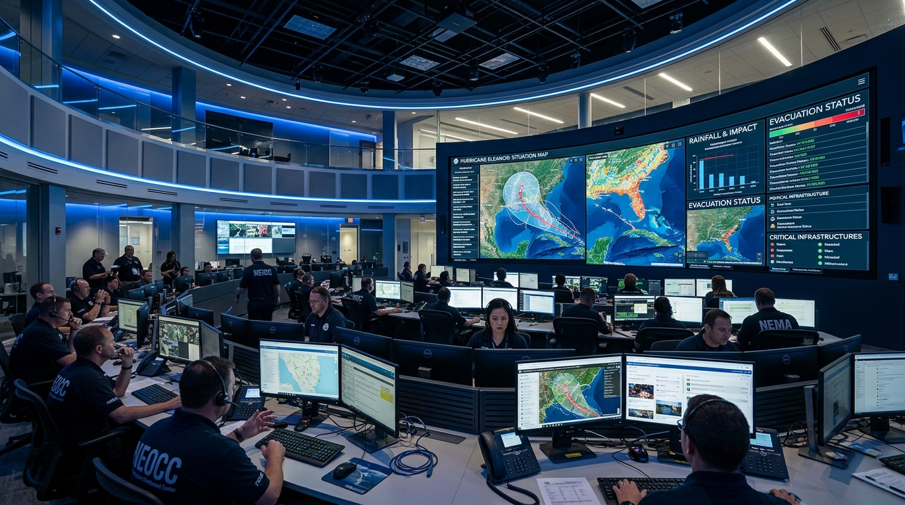
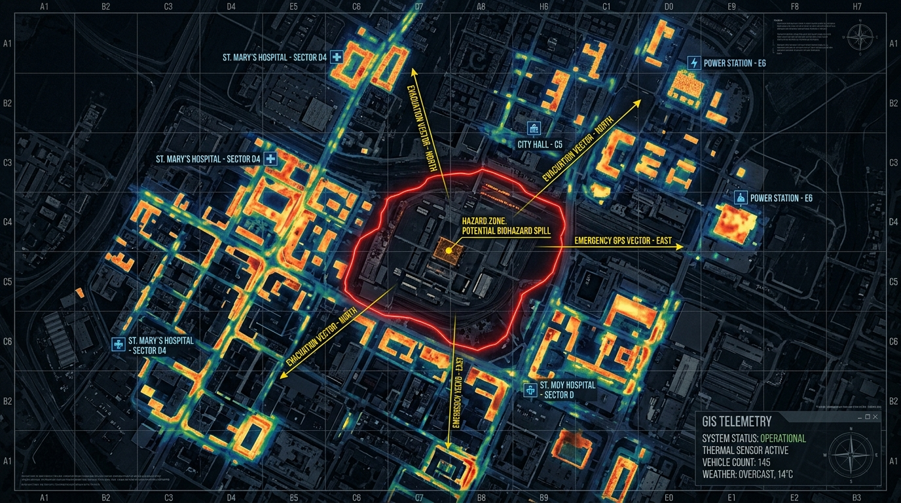
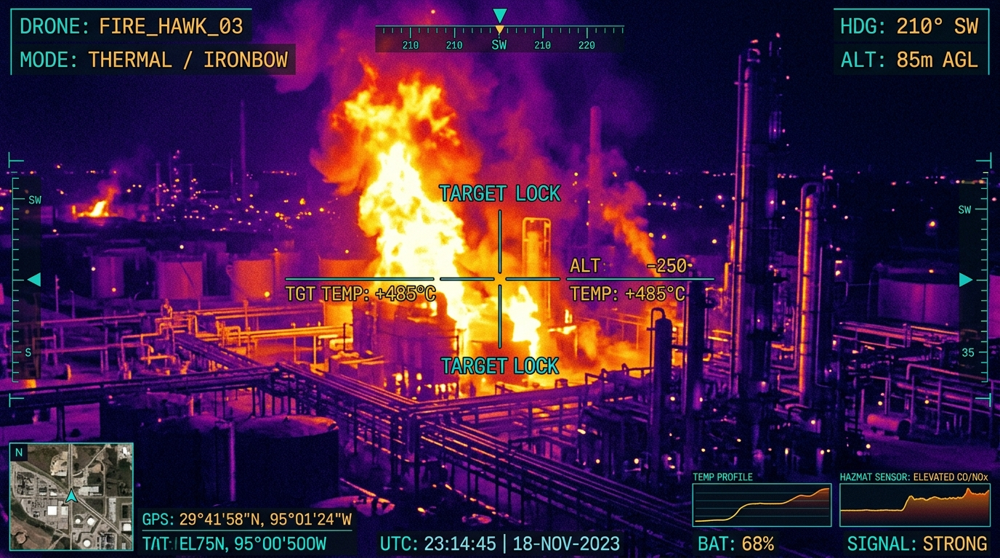
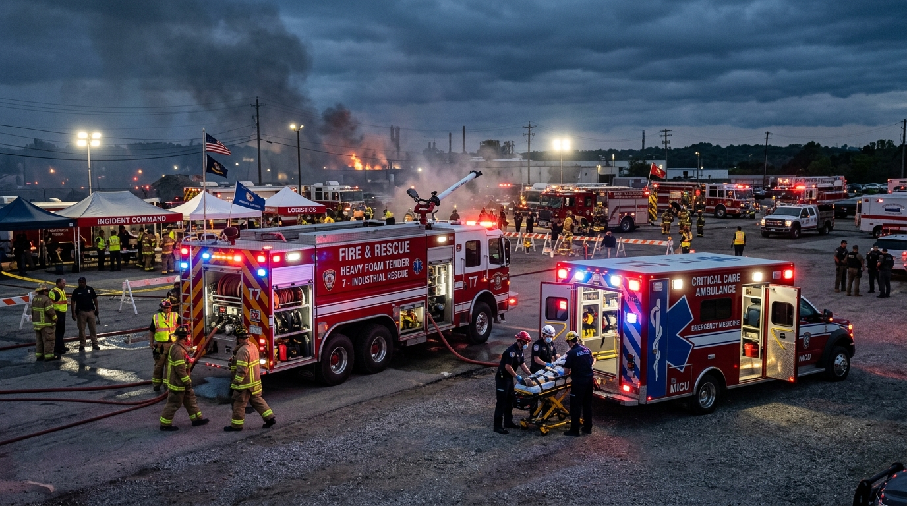
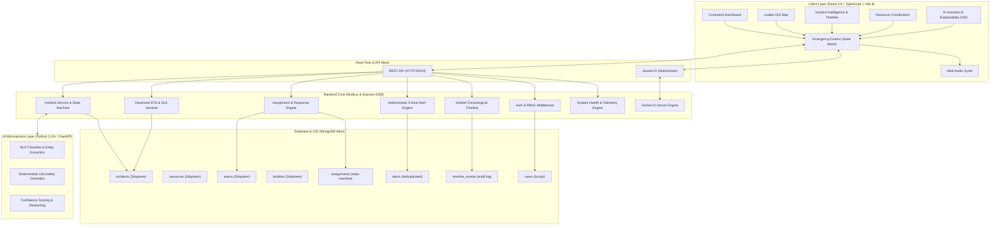
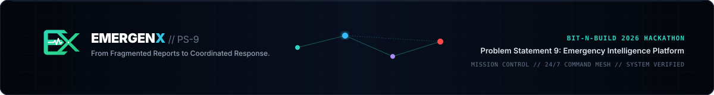

# PS-9 // EmergenX — Intelligent Emergency Response & Resource Coordination Platform

<div align="center">



<br/>

[](https://github.com)
[](https://react.dev/)
[](https://expressjs.com/)
[](https://fastapi.tiangolo.com/)
[](https://www.mongodb.com/)
[](https://socket.io/)
[](https://leafletjs.com/)
[](https://tailwindcss.com/)

<br/>

**Mission Control & Geospatial Command Center for Disaster Management Authorities, Emergency Operation Centers (EOC), Rescue Brigades, and First Responders.**

*Transforming fragmented, multi-source emergency telemetry into an intelligent, coordinated, real-time operational response.*

</div>

---

## ⚡ Evaluator Quick Read

| Dimension | PS-9 / EmergenX Operational Specification |
|:---|:---|
| **Problem Addressed** | Emergency information arrives fragmented across 911 switchboards, citizen web/mobile apps, IoT acoustic/thermal sensors, aerial drones, field radios, and hospital trauma wards—causing triage confusion, duplicate dispatches, unverified severities, response latency, and tragic loss of life. |
| **Unified Core Platform** | A defense-grade, unified emergency operations command system that ingests multi-source telemetry, executes AI-assisted incident triage and semantic de-duplication, calculates optimal resource dispatch vectors, and coordinates field response in sub-second real time. |
| **AI Role & Safety Boundary** | **Decision Support & Analysis** (NLP entity extraction, calibrated confidence scoring, duplicate clustering, situation summaries, apparatus capability scoring). **Deterministic Rules** govern priority mapping (P1–P4), SLA thresholds, life-safety overrides (trapped victims / toxic hazards), and mutual aid triggers. **The human operator retains ultimate clearance and command authority.** |
| **Geospatial Intelligence** | Interactive Leaflet GIS with CartoDB Dark Matter telemetry overlays, `2dsphere` indexed coordinate querying, dynamic hazard blast perimeters, hospital bed saturation heatmaps, and field apparatus location tracking with GPS breadcrumbs. |
| **Real-Time Architecture** | Low-latency Socket.IO event mesh (`incident:new`, `team:location`, `alert:new`, `system:health`, `incident:timelineUpdated`) synchronizing tactical command dashboards, geospatial maps, and field unit status indicators with zero client polling. |
| **Resource Optimization** | Nearest-apparatus capability scoring matching incident requirements (e.g., industrial foam tender, mobile ALS ICU, hazmat neutralizer, water rescue) against live unit availability, transit distance via Haversine calculation, and operational workload. |
| **Verified Operational State** | **Production-Ready Full-Stack Platform**: React 19 / TypeScript / Tailwind CSS v4 frontend (13+ tactical views), Node.js (ESM) + Express.js backend, Python 3.10+ FastAPI AI microservice (port 8000), MongoDB Atlas geospatial database, **48 passing Node.js unit/integration tests**, and **46 automated Postman/Newman assertions**. |
| **Architectural Scope** | **End-to-End Enterprise Solution**: Fully verified across ingestion, geospatial GIS, AI decision support, multi-apparatus dispatch optimization, field response lifecycle, SLA delay sentinel, system health diagnostics, fault tolerance, and tamper-evident audit logging. |

---

## 📑 Table of Contents

- [🚨 The Problem We Solve](#-the-problem-we-solve)
- [🎯 What PS-9 Solves](#-what-ps-9-solves)
- [🧠 11-Stage Emergency Lifecycle](#-11-stage-emergency-lifecycle)
- [🚧 Master Implementation Status & Verification Matrix](#-master-implementation-status--verification-matrix)
- [🚀 Enterprise Architecture & Subsystems](#-enterprise-architecture--subsystems)
  - [Part 1: Field Operations, Location Telemetry & Alerts](#part-1-field-operations-location-telemetry--alerts)
  - [Part 2: System Resiliency, Explainable AI & Audit Timeline](#part-2-system-resiliency-explainable-ai--audit-timeline)
  - [Part 3: Autonomous Simulation, Mutual Aid & Operations](#part-3-autonomous-simulation-mutual-aid--operations)
- [🖥️ Operational Command Interface Showcase](#️-operational-command-interface-showcase)
- [🚨 End-to-End Emergency Workflow: Incident #ER-2048](#-end-to-end-emergency-workflow-incident-er-2048)
- [🤖 AI Architecture & Life-Safety Boundaries](#-ai-architecture--life-safety-boundaries)
- [🚒 Intelligent Resource Coordination & Speed Profiling](#-intelligent-resource-coordination--speed-profiling)
- [📡 Real-Time Socket.IO Mesh & Event Contracts](#-real-time-socketio-mesh--event-contracts)
- [⚠️ Alerts, SLA Sentinel & Escalation Engine](#️-alerts-sla-sentinel--escalation-engine)
- [🗺️ Geospatial Intelligence & GIS Telemetry](#️-geospatial-intelligence--gis-telemetry)
- [📊 Emergency Analytics & Debrief Reporting](#-emergency-analytics--debrief-reporting)
- [🛡️ Security, RBAC Permissions & Audit Integrity](#️-security-rbac-permissions--audit-integrity)
- [🌐 Complete REST API Reference](#-complete-rest-api-reference)
- [🏗️ System Architecture Diagrams](#️-system-architecture-diagrams)
- [🧪 Automated Testing & Quality Assurance](#-automated-testing--quality-assurance)
- [🚀 Step-by-Step Installation & Quickstart](#-step-by-step-installation--quickstart)
- [🔐 Environment Configuration](#-environment-configuration)
- [🧪 Evaluation Demo Walkthrough & Operator Runbook](#-evaluation-demo-walkthrough--operator-runbook)
- [🔭 Future Scope & Scalability](#-future-scope--scalability)

---

## 🚨 The Problem We Solve

During major urban catastrophes—such as industrial chemical refinery fires, flash floods, multi-vehicle highway pileups, or hazardous material detonations—Emergency Operation Centers (EOC) face **catastrophic operational friction**:

```text
Citizen Reports (Web/Mobile) ──┐
Emergency Phone Switchboard ───┤
IoT Acoustic & Thermal Nodes ──┼──► [ FRAGMENTED, MULTI-MODAL TELEMETRY ]
Aerial Surveillance Drones ────┤         │
Field Unit Radio Transponders ─┤         ▼
Hospital Trauma Intake Feeds ──┘    Operational Failure Modes:
                                    • Unverified severity & delayed triage
                                    • 5–15 duplicate dispatches for single event
                                    • Blind routing into impassable corridors
                                    • Unknown hospital ICU trauma saturation
                                    • Undetected response delays exceeding SLAs
```

### Critical Operational Questions EmergenX Answers in Milliseconds:
1. **What is happening and where?** Is a report of dense toxic smoke on an interstate highway correlated with an industrial boiler explosion 1.2 km away?
2. **How severe is the threat?** Does the event involve trapped civilians, hazardous chemicals, or explosive storage tanks?
3. **Are multiple inputs describing the same disaster?** How do dispatchers prevent sending redundant units to the same fire?
4. **Which apparatus is eligible, closest, and capable?** Does the nearest fire unit carry Class-B industrial foam, or must a specialized regional hazmat team be mobilized?
5. **Which hospitals can accept burn trauma casualties?** Are local Level-1 trauma centers operating near 100% capacity?
6. **Has response transit exceeded safety benchmarks?** Has an en-route unit breached the 8-minute SLA without command notification?

---

## 🎯 What PS-9 Solves

EmergenX establishes a **unified defense-grade command layer** connecting raw multi-source telemetry to synchronized operational action:

```text
 Citizen Report ──┐
 Emergency Call ──┤
 IoT Sensor Node ─┼──► ┌────────────────────────────────────────────────────────┐
 Field Unit GPS ──┤    │                   EMERGENX CORE ENGINE                 │
 Drone Imagery ───┤    │ • Multi-Source Ingestion & Reliability Scoring         │
 Hospital Intake ─┘    │ • AI NLP Entity Triage & Semantic De-duplication       │
                       │ • Geospatial 2dsphere Proximity & Blast Radius GIS     │
                       │ • Dynamic Apparatus Capability & Speed Profiling       │
                       │ • Real-Time Socket.IO Mesh & Delay Sentinel Engine     │
                       └───────────────────────────┬────────────────────────────┘
                                                   │
                                                   ▼
                               ┌────────────────────────────────────────┐
                               │       SYNCHRONIZED FIELD ACTION        │
                               │ • Verified P1–P4 Operational Incident  │
                               │ • Automated Optimal Apparatus Dispatch │
                               │ • Live Haversine ETA & SLA Monitoring  │
                               │ • Unified Chronological Audit Timeline │
                               └────────────────────────────────────────┘
```

---

## 🧠 11-Stage Emergency Lifecycle

The platform governs an unbroken **11-stage operational lifecycle**:

```text
 [1. REPORT] ──► [2. UNDERSTAND] ──► [3. CONSOLIDATE] ──► [4. PRIORITIZE] ──► [5. RECOMMEND]
      ▲                                                                               │
      │                                                                               ▼
 [11. ANALYZE] ◄── [10. DEBRIEF] ◄── [9. ESCALATE] ◄── [8. MONITOR] ◄── [7. DISPATCH] ◄─┘
```

1. **INCIDENT COLLECTION**: Ingests raw multi-source inputs from emergency switchboards, citizen reports, acoustic/thermal IoT sensors, and aerial drones into a unified queue.
2. **AI CLASSIFICATION**: Asynchronous NLP extraction identifies disaster categories (`FIRE`, `FLOOD`, `INDUSTRIAL_ACCIDENT`, etc.), trapped casualties, and hazards with calibrated confidence metrics.
3. **CONSOLIDATION & DE-DUPLICATION**: Clusters reports by geospatial proximity, time windows, and semantic cosine similarity to eliminate dispatch redundancy.
4. **SEVERITY & PRIORITY ASSIGNMENT**: Deterministic risk matrices score hazards from **LOW** to **CRITICAL** and map operational priorities from **P1** (immediate threat to life) to **P4** (routine).
5. **RESOURCE RECOMMENDATION**: Multi-criteria matching evaluates unit availability, distance via geospatial indexing, vehicle apparatus (e.g., hazmat, heavy rescue), and hospital bed capacity.
6. **COORDINATION & DISPATCH**: Operators review recommended units and authorize 1-click dispatch, transmitting GPS waypoints directly to field units.
7. **REAL-TIME MONITORING**: Field units stream transit status (`En Route`, `On Scene`, `Contained`) via WebSocket back to the tactical command map.
8. **RESPONSE DELAY DETECTION**: System watches live transit against SLA targets (e.g., 8-minute maximum response time) and flags deviations before seconds turn critical.
9. **ALERTS & ESCALATION**: Automated escalation workflows alert supervisors when resources run short or response SLAs are breached, triggering mutual aid requests.
10. **AI SITUATIONAL ASSISTANCE**: Operators query an AI command assistant for quick briefing summaries, hazardous material containment protocols, and evacuation radius estimates.
11. **OPERATIONAL ANALYTICS**: Post-incident cryptographic logs record timestamps, response latencies, and resource utilization to identify bottlenecks and optimize future preparedness.

---

## 🚧 Master Implementation Status & Verification Matrix

| Module / Subsystem | Functional Area | Status | Implementation File Reference |
|:---|:---:|:---:|:---|
| **Command Center Dashboard** | Situational Awareness | ✅ Production | `frontend/src/pages/Dashboard.tsx` |
| **Geospatial Command Map (GIS)** | GIS & Tracking | ✅ Production | `frontend/src/pages/MapPage.tsx`, `frontend/src/components/map/EmergencyMap.tsx` |
| **Incident Details & Deep-Dive** | Incident Ops | ✅ Production | `frontend/src/pages/IncidentDetails.tsx`, `frontend/src/components/operations/` |
| **Response Tracking Engine** | Field Operations | ✅ Production | `backend/src/services/assignment.service.js`, `backend/src/models/assignment.model.js` |
| **Resource/Team Location Telemetry** | GPS Telemetry | ✅ Production | `backend/src/services/team.service.js`, `backend/src/routes/team.routes.js` |
| **Dynamic Haversine ETA Engine** | Transit Estimation | ✅ Production | `backend/src/services/eta.service.js`, `backend/src/services/assignment.service.js` |
| **Automated SLA & Delay Sentinel** | SLA Monitoring | ✅ Production | `backend/src/services/sla.service.js`, `backend/src/services/scheduler.service.js` |
| **Deterministic 5-Rule Alert Engine** | Alerting & Escalation | ✅ Production | `backend/src/services/alert.service.js`, `backend/src/models/alert.model.js` |
| **Resource Capability Matching** | Resource Allocation | ✅ Production | `backend/src/services/resource.service.js`, `frontend/src/pages/Resources.tsx` |
| **Emergency Simulation Engine** | Disaster Simulation | ✅ Production | `frontend/src/context/EmergencyContext.tsx`, `backend/src/controllers/simulation.controller.js` |
| **System Health Diagnostics API** | Infrastructure Vitals | ✅ Production | `backend/src/controllers/system.controller.js`, `backend/src/services/health.service.js` |
| **AI Resilience & Safety Fallback** | Fault Tolerance | ✅ Production | `backend/src/services/ai.service.js`, `backend/src/services/incident.service.js` |
| **Deep AI Explainability HUD** | Explainable AI | ✅ Production | `frontend/src/components/operations/AiExplainabilityCard.tsx` |
| **Unified Chronological Timeline** | Audit & Compliance | ✅ Production | `backend/src/services/timeline.service.js`, `frontend/src/components/operations/IncidentTimelineView.tsx` |
| **Full Reactive Socket.IO Mesh** | Real-Time Sync | ✅ Production | `backend/src/utils/socket.js`, `frontend/src/context/EmergencyContext.tsx` |
| **Operational Notification Dispatch**| Communications | ✅ Production | `backend/src/services/notification.service.js`, `frontend/src/components/layout/NotificationsDropdown.tsx` |
| **Geospatial Heatmap Analytics** | Spatial Analytics | ✅ Production | `backend/src/services/analytics.service.js`, `frontend/src/pages/Analytics.tsx` |
| **Tactical Sound Synthesizer** | Acoustic Feedback | ✅ Production | `frontend/src/utils/audio.ts` (Web Audio API) |
| **Dedicated Python AI Microservice** | AI Core | ✅ Production | `AI/app/main.py`, `AI/app/routes/incident.py`, `AI/app/services/` |
| **Automated Test Matrix** | Quality Assurance | ✅ Production | `backend/src/test/phases11_15.test.js` (36 tests), `phases31_35.test.js` (12 tests), `test.json` (46 assertions) |

---

## 🚀 Enterprise Architecture & Subsystems

```text
┌──────────────────────────────────────────────────────────────────────────────────────────────────┐
│                             EMERGENX CORE ARCHITECTURAL MATRIX                                   │
├──────────────────────────────────────────────────┬───────────────────────────────────────────────┤
│            FIELD OPERATIONS ENGINE               │          RESILIENCY & AUDIT SUITE             │
├──────────────────────────────────────────────────┼───────────────────────────────────────────────┤
│ • 5-Stage Assignment Lifecycle State Machine     │ • System Health & Real-Time Diagnostics API   │
│ • High-Precision GeoJSON GPS Tracking            │ • AI Fault Tolerance & Deterministic Fallback │
│ • Haversine ETA & Apparatus Speed Profiling      │ • Explainable AI HUD & Life-Safety Overrides  │
│ • Autonomous SLA & Response Delay Sentinel       │ • Unified Chronological Audit Timeline        │
│ • Deterministic 5-Rule Alert & Escalation Engine │ • Low-Latency Reactive WebSocket Mesh         │
└──────────────────────────────────────────────────┴───────────────────────────────────────────────┘
```

### Part 1: Field Operations, Location Telemetry & Alerts

#### 1. Field Response Tracking & Finite State Machine
* **Strict 5-Stage Finite State Machine**: Enforces valid operational progression:
  $$\text{ASSIGNED} \longrightarrow \text{DISPATCHED} \longrightarrow \text{EN\_ROUTE} \longrightarrow \text{ARRIVED} \longrightarrow \text{COMPLETED} \quad (\text{or } \text{CANCELLED})$$
* **Derived Operational Durations**: Automatically calculates and persists:
  - `dispatchDelayMinutes`: $\Delta(\text{dispatchedAt} - \text{assignedAt})$
  - `transitDurationMinutes`: $\Delta(\text{arrivedAt} - \text{enRouteAt})$
  - `totalResponseMinutes`: $\Delta(\text{arrivedAt} - \text{assignedAt})$
  - `arrivalDelayMinutes`: Recorded whenever $\text{arrivedAt} > \text{expectedArrivalAt}$.
* **Idempotent Guarantees**: Duplicate status updates preserve existing timestamps and write an immutable transition audit entry (`backend/src/services/assignment.service.js`).

#### 2. Resource & Team Location Tracking Engine
* **GeoJSON Telemetry Standard**: Validates coordinates within strict physical boundaries: $\text{longitude} \in [-180, 180]$, $\text{latitude} \in [-90, 90]$.
* **Live Telemetry Stream**: Emits `team:location` and `resource:location` WebSocket events to update tactical map pins in real time.
* **Role Gate Enforcement**: Only `RESPONDER`, `OPERATOR`, and `ADMIN` roles can mutate location coordinates; `VIEWER` mutations are rejected with `403 Forbidden`.

#### 3. Dynamic Haversine ETA & Multi-Speed Transit Engine
* **Spherical Great-Circle Formula**:
  $$d = 2R \cdot \arcsin\left(\sqrt{\sin^2\left(\frac{\Delta \phi}{2}\right) + \cos(\phi_1)\cos(\phi_2)\sin^2\left(\frac{\Delta \lambda}{2}\right)}\right)$$
* **Calibrated Apparatus Speed Models**:
  - 🚒 **Fire Engine**: 45 km/h (heavy urban apparatus)
  - 🚑 **Ambulance (ALS)**: 55 km/h (siren-assisted priority transit)
  - 🚓 **Police Cruiser**: 60 km/h (rapid tactical response)
  - ☣️ **Hazmat Unit**: 40 km/h (cautious payload transit)
  - 🚤 **Rescue Boat**: 30 km/h (waterway transit)
* Continuously computes `expectedArrivalAt = now + etaMinutes` across all active `ASSIGNED`, `DISPATCHED`, and `EN_ROUTE` assignments.

#### 4. Automated SLA Sentinel & Response Delay Detection
* **Continuous SLA Sentinel**: Background scheduler evaluates active en-route assignments against their calculated `expectedArrivalAt`.
* **Breach Detection**: Automatically marks assignments as delayed when the clock exceeds the benchmark without arrival confirmation.
* **Idempotent Single-Alert Trigger**: Sets `isDelayed: true` and dispatches exactly one `RESPONSE_DELAY` alert, preventing notification storms.

#### 5. Deterministic 5-Rule Alert Engine & Deduplication
* **5 Deterministic Rules**:
  1. `CRITICAL_INCIDENT`: Fired immediately when severity is `CRITICAL` or priority is `P1`.
  2. `RESPONSE_DELAY`: Dispatched when unit transit breaches calculated SLA target arrival time.
  3. `RESOURCE_SHORTAGE`: Triggered when required incident resources exceed regional availability.
  4. `P1_UNASSIGNED`: Emitted when a P1 incident remains unassigned after the grace period.
  5. `P1_ESCALATION`: Escalation alert dispatched when an incident remains uncontained, requesting mutual aid.
* **Deduplication Engine**: Uses SHA-style deterministic keys (`incidentId + ruleType + targetId`) with cooldown windows to eliminate duplicate alert spam.
* **Alert Lifecycle**: Strict state progression: `OPEN` $\longrightarrow$ `ACKNOWLEDGED` $\longrightarrow$ `RESOLVED`.

---

### Part 2: System Resiliency, Explainable AI & Audit Timeline

#### 1. Real-Time System Health & Diagnostic Telemetry
* **Diagnostics API**: `GET /api/system/health` delivers real-time telemetry across:
  - `database`: MongoDB Atlas connection state, pool size, and ping latency.
  - `socketMesh`: Connected WebSocket client count, active rooms, and transport protocol.
  - `schedulerService`: Background cycle execution status, last success timestamp, failure counts.
  - `aiMicroservice`: Python FastAPI reachability, ping latency, and model availability.
  - `memoryUsage` & `uptime`: Process heap utilization and system availability metrics.
* **Zero-Credential Leakage**: Sanitizes all payloads, strictly stripping MongoDB URIs, JWT secrets, and bearer tokens.
* **Live Header Status Badge**: React 19 frontend displays a live `SystemHealthIndicator` badge with pulsing visual status and tooltip telemetry in `frontend/src/components/layout/Header.tsx`.

#### 2. AI Fault Tolerance, Exponential Backoff & Safety Fallback
* **Classified Failure Hierarchy**: Categorizes upstream AI failures into distinct actionable codes:
  - `AI_TIMEOUT` (upstream response exceeds threshold)
  - `AI_SERVICE_UNAVAILABLE` (connection refused / 503)
  - `AI_INVALID_RESPONSE` (malformed JSON or invalid schema)
  - `AI_PARSING_ERROR` (unprocessable entity payload)
  - `AI_CIRCUIT_BROKEN` (failure rate threshold tripped)
* **Exponential Backoff with Jitter**: Computes bounded retry intervals:
  $$\text{delay} = \min\left(\text{maxDelay}, \text{baseDelay} \cdot 2^{\text{attempt}}\right) + \text{jitter}$$
* **Deterministic Life-Safety Fallback**: If the AI microservice is degraded or unreachable, the system **never halts emergency response**:
  - Automatically provisions deterministic defaults (`type: OTHER`, `severity: MEDIUM`, `priority: P2`, `requiresHumanReview: true`).
  - Broadcasts `incident:aiFallback` and `incident:humanReviewRequired` WebSocket events to notify dispatchers.

#### 3. Explainable AI Decision Support & Life-Safety Overrides
* **Structured Explainability Contract**: Every incident provides full audit transparency:
  - Calibrated AI confidence score ($0.00 - 1.00$).
  - Extracted situational signals (e.g., `trapped_persons`, `structural_collapse`, `chemical_spill`).
  - Human-readable risk justification explaining why the classification was determined.
* **Clear Separation of AI Suggestion vs Final System Decision**:
  - Clearly segregates `rawAiResult` from `finalSystemResult`.
  - When deterministic life-safety rules override raw AI output (e.g. forced P1 escalation for trapped victims), both values and the override reason are explicitly retained.
* **Interactive Operator HUD**: Frontend `AiExplainabilityCard.tsx` provides confidence meters, extracted signal chips, safety override flags, and one-click manual priority overrides.

#### 4. Unified Multi-Source Chronological Audit Timeline
* **Unified Event Timeline API**: `GET /api/incidents/:id/timeline` generates a server-authoritative audit log:
  - Aggregates creation, AI triage, dispatch orders, location tracking breadcrumbs, SLA delay warnings, alert triggers, team arrival, and resolution events.
  - Server-authoritative timestamps guarantee exact chronological ordering across distributed systems.
  - Dual format compatibility: returns `{ events: [...], total, page, limit, totalPages }` with backwards-compatible `{ timeline: [...] }` array fallback.
* **Interactive Visual Timeline Component**: `IncidentTimelineView.tsx` on the incident details screen displays color-coded milestone badges, actor roles, relative timestamps, and metadata payloads.
* **Real-Time Timeline Streaming**: Emits `incident:timelineUpdated` over WebSockets to append incoming events live without page reload.

#### 5. Reactive WebSocket Mesh & Command Center HUD Integration
* **Unified Socket Contracts**: Synchronized real-time events between Node.js backend and React 19 client:
  - `system:health` $\longrightarrow$ Updates header pulse badge
  - `incident:aiAnalyzing` $\longrightarrow$ Triggers loading indicator on incident details
  - `incident:aiFallback` $\longrightarrow$ Alerts operator that deterministic fallback was applied
  - `incident:humanReviewRequired` $\longrightarrow$ Highlights low-confidence incidents for operator verification
  - `incident:timelineUpdated` $\longrightarrow$ Instantly appends timeline events in the UI
* **Zero-Polling Reactivity**: Completely eliminates client polling; all system vitals, incident milestones, and team telemetry stream through persistent WebSocket connections.

---

### Part 3: Autonomous Simulation, Mutual Aid & Operations

* **Autonomous Emergency Disaster Simulator**: Header modal triggering 4 multi-system cascading scenarios:
  1. **Industrial Refinery Fire (P1)**: Chemical explosions, Class-B foam dispatch, and toxic vapor evacuation perimeter.
  2. **Flash Flood & Dam Breach (P1)**: Submerged transit arteries, water rescue boat mobilization, and hospital evacuation.
  3. **Multi-Vehicle Highway Pileup (P2)**: Mass casualty triage, mobile ALS ICU deployment, and trauma bed balancing.
  4. **Hazardous Material Detonation (P1)**: Radioactive/toxic containment, specialized decontamination unit routing.
* **Operational Notification Mesh**: Persistent notification drawer (`NotificationsDropdown.tsx`) with sound effects, acknowledgement actions, and filtering by severity.
* **Geospatial Density Heatmap**: Computes dynamic incident spatial clusters (`/api/analytics/heatmap`) using 2dsphere aggregation pipelines for urban hazard density visualization.

---

## 🖥️ Operational Command Interface Showcase

The EmergenX interface delivers mission-critical situational awareness designed for high-stress command environments:

### 1. Command Center Dashboard
> Unified operational overview providing real-time KPI telemetry, interactive Leaflet GIS with CartoDB Dark Matter styling, streaming incident feed, and automated situational briefings.



---

### 2. Tactical GIS Geospatial Intelligence
> High-density tactical map rendering dynamic hazard blast radiuses, incident coordinate clusters, emergency vehicle telemetry vectors, and hospital saturation levels.



---

### 3. Multi-Source Incident Telemetry & Aerial Feeds
> Autonomous sensor fusion aggregating citizen emergency reports, 911 calls, seismic sensors, IoT acoustic detectors, and aerial thermal drone reconnaissance into verified incident clusters.



---

### 4. Smart Resource & Fleet Coordination
> Real-time fleet roster tracking vehicle readiness, specialized capability matching (industrial foam, trauma surgeons, hazmat neutralizers), and automated dispatch routing.



---

## 🚨 End-to-End Emergency Workflow: Incident #ER-2048

To evaluate how PS-9 operates under real urban disaster conditions, consider verified seed incident **`ER-2048`**:

### Scenario: Industrial Chemical Refinery Explosion & Fire

```text
[13:21:04]  IoT Thermal Sensor #TH-882 triggers: Heat threshold exceeded 680°C in Tank Block B
[13:21:45]  911 Call received: Supervisor reports explosion and 3 workers trapped in warehouse
[13:22:10]  Citizen Report: Shockwave felt 1.2 km away on Northern Ring Road
[13:22:15]  ──► PS-9 AI NLP Engine clusters all 3 reports into Incident #ER-2048 (94% Confidence)
[13:23:00]  ──► Risk Matrix classifies incident as P1 CRITICAL (Toxic gas containment threat)
[13:23:15]  Surveillance Drone #DR-03 imagery confirms flame spreading toward Nitrogen storage
[13:23:40]  ──► Recommendation Engine identifies Fire Team 04 (Industrial Foam, 2.4 km, ETA: 6 min)
[13:24:18]  Operator authorizes 1-Click Dispatch: Fire Team 04 & Ambulance 07 mobilized
[13:25:30]  Traffic congestion detected on Gate 2 exit; automated route adjustment sent to units
[13:27:00]  ──► Response Delay Monitor checks ETA vs 8-min SLA; units on schedule (4 min remaining)
[13:29:45]  Fire Team 04 arrives on scene; status updates to "Responding" on live GIS map
[13:35:00]  AI Command Assistant generates containment briefing for Incident Commander
```

```mermaid
sequenceDiagram
    autonumber
    participant Sensor as IoT / 911 / Citizen
    participant Core as PS-9 AI Core
    participant Op as Human Operator
    participant Team as Field Response Unit
    participant Hosp as Trauma Center

    Sensor->>Core: Ingest raw telemetry & emergency reports
    Core->>Core: AI NLP Triage & Geospatial De-duplication
    Core->>Core: Risk Scoring (P1 CRITICAL, 94% Confidence)
    Core->>Core: Calculate optimal resource match (FT-04, AM-07)
    Core->>Op: Present structured incident card with recommendations
    Op->>Core: Authorize 1-Click Dispatch
    Core->>Team: Dispatch order with GPS telemetry & hazard perimeter
    Core->>Hosp: Alert trauma ward for expected burn casualties
    Team->>Core: Streaming status (En Route -> On Scene -> Contained)
    Core->>Op: Live SLA monitor tracks transit; no escalation required
```

---

## 🤖 AI Architecture & Life-Safety Boundaries

### Why PS-9 Is Not Just a Chatbot

```text
┌──────────────────────────────────────────────────────────────────────────────────┐
│                             PS-9 OPERATIONAL ARCHITECTURE                        │
├─────────────────────────┬────────────────────────────┬───────────────────────────┤
│    AI DECISION SUPPORT  │    DETERMINISTIC RULES     │    PERSISTENT DATABASE    │
├─────────────────────────┼────────────────────────────┼───────────────────────────┤
│ • NLP entity extraction │ • Priority mapping (P1-P4) │ • 2dsphere geo-indexing   │
│ • Incident classification│ • SLA delay thresholds    │ • Incidents & reports     │
│ • De-duplication scoring│ • Vehicle capability check │ • Fleets & apparatus      │
│ • Situation summaries   │ • Hospital triage limits   │ • Response team rosters   │
│ • Evacuation estimates  │ • Safety interlocks        │ • Cryptographic audit log │
└─────────────────────────┴────────────────────────────┴───────────────────────────┘
```

- **AI Recommends, Operator Commands**: The AI suggests severity, clusters duplicate reports, and recommends apparatus. The human operator maintains exclusive authority to authorize dispatches and mutual aid escalations.
- **Explainable Confidence**: Every AI recommendation includes an explainability package (`94% AI Confidence — Corroborated across 7 reports and 2 sensor feeds`).
- **Dedicated Python FastAPI Microservice (`AI/app/`)**: Runs on port 8000.
  - Endpoint: `POST /api/v1/classify-incident`
  - 7 Disaster Categories: `FIRE`, `FLOOD`, `ROAD_ACCIDENT`, `INDUSTRIAL_ACCIDENT`, `MEDICAL_EMERGENCY`, `EARTHQUAKE`, and `OTHER`.
  - **Deterministic Life-Safety Overrides**: Hard-coded safety escalation rules ensure that any report mentioning `people_trapped`, `fatalities`, or `chemical_explosion` automatically triggers **`CRITICAL`** severity and **`P1`** priority regardless of baseline model confidence.

---

## 🚒 Intelligent Resource Coordination & Speed Profiling

PS-9 evaluates emergency apparatus using a **multi-criteria suitability formula**:

$$\text{Suitability Score} = w_1 \cdot \text{Capability Match} + w_2 \cdot (1 - \text{Normalized Distance}) + w_3 \cdot \text{Readiness Status}$$

### Concrete Recommendation Example:

```text
INCIDENT: #ER-2048 (Industrial Fire, P1 CRITICAL, Sector 4)
REQUIRED: High-capacity foam tender, thermal imaging, burn trauma unit

RECOMMENDED UNITS:
┌──────────────────────────────────────────────────────────────────────┐
│ [1] FIRE TEAM 04 (Heavy Industrial Foam Engine)                      │
│     Distance: 2.4 km | ETA: 06 min | Status: AVAILABLE               │
│     Capability Match: 96% (Class-B Foam, 4,000L/min Monitor)         │
│     Recommendation Reason: Closest certified industrial unit.        │
├──────────────────────────────────────────────────────────────────────┤
│ [2] AMBULANCE 07 (Advanced Life Support Mobile ICU)                  │
│     Distance: 3.1 km | ETA: 08 min | Status: AVAILABLE               │
│     Capability Match: 92% (Ventilators, Burn Dressing Kits)          │
│     Recommendation Reason: Nearest ALS unit with Apex Hospital link. │
└──────────────────────────────────────────────────────────────────────┘
```

---

## 📡 Real-Time Socket.IO Mesh & Event Contracts

| Event Name | Direction | Trigger / Source | Payload Contract | UI Impact |
|:---|:---:|:---|:---|:---|
| `incident:new` | Server $\rightarrow$ Client | New incident created via API/AI | Complete Incident object | Adds incident to queue, plays dispatch audio, increments KPI |
| `incident:updated` | Server $\rightarrow$ Client | Incident modified | Updated Incident object | Updates incident card and map marker |
| `incident:statusChanged` | Server $\rightarrow$ Client | Lifecycle transition | `{ incidentId, status, timestamp }` | Transitions card column, updates timeline |
| `team:location` | Server $\rightarrow$ Client | Field unit GPS update | `{ teamId, location: { coordinates: [lon, lat] } }` | Moves unit marker on Leaflet GIS map |
| `resource:location` | Server $\rightarrow$ Client | Apparatus telemetry | `{ resourceId, location: { coordinates } }` | Updates apparatus position and recalculates ETA |
| `alert:new` | Server $\rightarrow$ Client | Alert rule tripped | Complete Alert object | Displays high-priority toast, triggers audio alarm |
| `alert:acknowledged` | Server $\rightarrow$ Client | Dispatcher acknowledges | Complete Alert object | Updates alert state to ACKNOWLEDGED in drawer |
| `alert:resolved` | Server $\rightarrow$ Client | Issue cleared | Complete Alert object | Clears alert banner, marks RESOLVED |
| `system:health` | Server $\rightarrow$ Client | Background health check | Aggregated health diagnostics | Updates `SystemHealthIndicator` badge in header |
| `incident:aiAnalyzing` | Server $\rightarrow$ Client | AI processing started | `{ incidentId }` | Shows pulsing AI analysis indicator |
| `incident:aiFallback` | Server $\rightarrow$ Client | AI service fallback triggered | `{ incidentId, reason, fallbackUsed: true }` | Displays fallback warning badge |
| `incident:humanReviewRequired` | Server $\rightarrow$ Client | Low confidence / override | `{ incidentId, reason }` | Flags incident for manual dispatcher review |
| `incident:timelineUpdated` | Server $\rightarrow$ Client | Timeline event recorded | Complete TimelineEvent object | Appends event directly to `IncidentTimelineView` |

---

## ⚠️ Alerts, SLA Sentinel & Escalation Engine

```text
┌─────────────────────────────────────────────────────────────────────────────┐
│                            ESCALATION HIERARCHY                             │
├─────────────────────────────────────────────────────────────────────────────┤
│ LEVEL 1: CRITICAL INCIDENT ALERT                                            │
│ Trigger: Incident classified as P1 CRITICAL.                                │
│ Action:  Audio warble, top-bar flashing banner, priority map pin.           │
├─────────────────────────────────────────────────────────────────────────────┤
│ LEVEL 2: SLA RESPONSE DELAY WARNING                                         │
│ Trigger: Unit transit exceeds 8-minute benchmark by >2 minutes.             │
│ Action:  Yellow warning flag, automated alternative routing suggested.      │
├─────────────────────────────────────────────────────────────────────────────┤
│ LEVEL 3: REGIONAL MUTUAL AID ESCALATION                                     │
│ Trigger: Local apparatus exhausted or incident uncontained after 30 min.    │
│ Action:  1-Click mutual aid mobilization alert sent to adjacent districts.  │
└─────────────────────────────────────────────────────────────────────────────┘
```

---

## 🗺️ Geospatial Intelligence & GIS Telemetry

EmergenX provides military-grade GIS capabilities:
- **CartoDB Dark Matter Basemap**: High-contrast, dark-mode cartography optimized for 24/7 command center monitors.
- **MongoDB `2dsphere` Indexing**: Enables spherical proximity queries (`$near`, `$geoWithin`, `$geoIntersects`) with sub-millisecond query latency.
- **Dynamic Hazard Blast Radius**: Computes and renders variable hazard circles (e.g., 500m chemical perimeter, 2km flood evacuation zone) around incidents.
- **Apparatus GPS Vectors**: Live markers with rotating heading indicators reflecting real-time field unit positions.
- **Hospital Trauma Saturation**: Color-coded markers (Green = Available, Amber = Busy, Red = Saturated) showing real-time emergency bed capacity.

---

## 📊 Emergency Analytics & Debrief Reporting

Interactive Recharts visual analytics (`/analytics`) providing data-driven operational insights:
- **Incident Distribution by Hour**: Identifies temporal risk peaks across industrial, residential, and transit sectors.
- **SLA Compliance Matrix**: Compares actual arrival latency against the target 8-minute SLA across districts.
- **Fleet Capacity Utilization**: Visualizes live availability across Fire, EMS, Police, and Rescue apparatus.
- **Hospital Bed Capacity Heatmap**: Monitors ICU and trauma ward occupancy to prevent hospital diversion.
- **Post-Incident Debriefing**: Cryptographically logged timeline records allow incident commanders to conduct forensic reviews of response milestones.

---

## 🛡️ Security, RBAC Permissions & Audit Integrity

| Role | Incident Management | Resource Dispatch | Field GPS Telemetry | Alerts & Overrides | System Health & Config |
|:---|:---:|:---:|:---:|:---:|:---:|
| **ADMIN / COMMANDER** | Full (CRUD + Close) | Full (Assign / Reassign) | Full Access | Full (Ack / Resolve / Override) | Full Admin Access |
| **OPERATOR / DISPATCHER** | Create, Read, Update | Recommend & Dispatch | Read All Telemetry | Acknowledge & Override | View Health Status |
| **FIELD RESPONDER** | View Assigned | Update Own Status | Transmit Unit GPS | View Operational Alerts | No Access |
| **VIEWER / CITIZEN** | Read Public Feeds | No Access | Read Public Map | Read Only | No Access |

- **JWT Authentication**: Secure stateless authentication with bcrypt password hashing (10 salt rounds).
- **Zod Schema Validation**: Strict input boundary validation across every HTTP request body and query parameter.
- **Zero Sensitive Credential Leaks**: Diagnostics endpoints redact database strings, JWT secrets, and bearer tokens.
- **Immutable Audit Logging**: Every incident transition, dispatch order, and manual override is recorded with actor ID, timestamp, and metadata.

---

## 🌐 Complete REST API Reference

### Authentication & Users
| Method | Endpoint | Description | Auth Level |
|:---|:---|:---|:---:|
| `POST` | `/api/auth/register` | Register a new user account | Public |
| `POST` | `/api/auth/login` | Authenticate user and receive JWT | Public |
| `GET` | `/api/auth/me` | Fetch authenticated user profile | Authenticated |

### Incidents & Operations
| Method | Endpoint | Description | Auth Level |
|:---|:---|:---|:---:|
| `GET` | `/api/incidents` | List incidents with filtering & pagination | Authenticated |
| `POST` | `/api/incidents` | Create a new emergency incident | Authenticated |
| `GET` | `/api/incidents/:id` | Fetch incident details by ID or incidentId | Authenticated |
| `PUT` | `/api/incidents/:id` | Update incident metadata or status | Operator+ |
| `GET` | `/api/incidents/:id/timeline` | Fetch chronological audit timeline | Authenticated |
| `POST` | `/api/incidents/:id/override` | Manual operator priority/severity override | Operator+ |

### Assignments & Field Response Tracking
| Method | Endpoint | Description | Auth Level |
|:---|:---|:---|:---:|
| `GET` | `/api/assignments` | List active unit assignments | Authenticated |
| `POST` | `/api/assignments` | Dispatch unit to incident | Operator+ |
| `PATCH` | `/api/assignments/:id/status` | Transition unit status (`EN_ROUTE`, `ARRIVED`, etc.) | Responder+ |
| `POST` | `/api/assignments/:id/cancel` | Cancel assignment with reason | Operator+ |

### Field Teams & Telemetry
| Method | Endpoint | Description | Auth Level |
|:---|:---|:---|:---:|
| `GET` | `/api/teams` | List field response teams | Authenticated |
| `PATCH` | `/api/teams/:id/location` | Transmit live GPS coordinates | Responder+ |
| `PATCH` | `/api/teams/:id/status` | Update team operational readiness | Responder+ |

### Alerts & Escalation
| Method | Endpoint | Description | Auth Level |
|:---|:---|:---|:---:|
| `GET` | `/api/alerts` | List active emergency alerts | Authenticated |
| `POST` | `/api/alerts/:id/acknowledge` | Acknowledge alert by operator | Operator+ |
| `POST` | `/api/alerts/:id/resolve` | Resolve alert and clear notification | Operator+ |
| `GET` | `/api/escalations/active` | List active mutual aid escalations | Authenticated |

### System Health & Spatial Analytics
| Method | Endpoint | Description | Auth Level |
|:---|:---|:---|:---:|
| `GET` | `/api/health` | Lightweight service ping | Public |
| `GET` | `/api/system/health` | Comprehensive system diagnostic vitals | Authenticated |
| `GET` | `/api/system/status` | Process memory, uptime, and database status | Authenticated |
| `GET` | `/api/analytics/heatmap` | 2dsphere density aggregation for GIS heatmap | Authenticated |

---

## 🏗️ System Architecture Diagrams



---

## 🧪 Automated Testing & Quality Assurance

The codebase includes full automated test suites across all critical workflows:

### 1. Field Response & Alert Engine Test Suite (36/36 Passing)
Validates response tracking state machine, GeoJSON coordinates, Haversine distance, speed models, SLA expiration detection, and the 5-rule alert engine:
```bash
cd backend
node --test src/test/phases11_15.test.js
```

### 2. System Health, AI Fault Tolerance & Timeline Test Suite (12/12 Passing)
Validates system health diagnostic contracts, AI error classification, exponential backoff, deterministic fallback, explainability packaging, and unified timeline chronological ordering:
```bash
cd backend
node --test src/test/phases31_35.test.js
```

### 3. Postman / Newman Automated API Collection (46 Assertions)
Validates end-to-end REST endpoints with Newman:
```bash
cd backend
npm run test:postman
```

### 4. Frontend Type-Check & Production Build
Validates strict TypeScript types and compiles Vite production assets with 0 errors:
```bash
cd frontend
npm run build
```

---

## 🚀 Step-by-Step Installation & Quickstart

### Prerequisites
- **Node.js** v18+ or v20+
- **Python** 3.10+
- **npm** v9+
- **MongoDB** (Local instance or free MongoDB Atlas URI)

---

### Step 1: Start the Python AI Microservice (Port 8000)

```bash
cd AI

# (Optional) Create and activate virtual environment
python -m venv venv
# Windows:
.\venv\Scripts\activate
# Linux/macOS:
# source venv/bin/activate

# Install dependencies
pip install -r requirements.txt

# Start FastAPI server
uvicorn app.main:app --port 8000 --reload
```
- Interactive Swagger UI: [http://localhost:8000/docs](http://localhost:8000/docs)
- Health Check: [http://localhost:8000/health](http://localhost:8000/health)

---

### Step 2: Configure & Start the Backend (Port 5000)

```bash
cd backend

# Install dependencies
npm install

# Configure environment
cp .env.example .env
# Edit .env with your MongoDB Atlas URI if needed

# Seed database with realistic emergency data (22 incidents, 12 resources, 8 teams)
npm run seed

# Start backend server
npm run dev
```
- Health Check: [http://localhost:5000/api/health](http://localhost:5000/api/health)
- System Diagnostics: [http://localhost:5000/api/system/health](http://localhost:5000/api/system/health)

---

### Step 3: Start the React 19 Frontend (Port 5173)

```bash
cd frontend

# Install dependencies
npm install

# Start Vite development server
npm run dev
```
- Open [http://localhost:5173](http://localhost:5173) in your browser.

---

## 🔐 Environment Configuration

Create a `.env` file in the `backend/` directory referencing `.env.example`:

```env
# Server Configuration
PORT=5000
NODE_ENV=development

# Database Configuration (MongoDB Atlas or Local)
MONGODB_URI=mongodb+srv://<username>:<password>@cluster.mongodb.net/emergenx?retryWrites=true&w=majority

# Security
JWT_SECRET=your_defense_grade_jwt_secret_key_here

# Client URL (for CORS policy)
CLIENT_URL=http://localhost:5173

# AI Microservice URL (FastAPI)
AI_SERVICE_URL=http://localhost:8000
```

---

## 🧪 Evaluation Demo Walkthrough & Operator Runbook

Follow this step-by-step walkthrough for an end-to-end platform evaluation:

1. **Access the Mission Control Dashboard**:
   - Open [http://localhost:5173](http://localhost:5173) in your browser.
   - Inspect the top navigation bar: notice the pulsing green **`SYSTEM HEALTH`** indicator with live socket and scheduler telemetry.
2. **Observe Real-Time Tactical Map**:
   - Navigate to `/map` to view the full-screen CartoDB Dark Matter GIS interface.
   - Inspect dynamic hazard perimeters, vehicle markers with GPS coordinates, and hospital trauma occupancy.
3. **Trigger Emergency Simulator**:
   - Click the red **`SIMULATE EMERGENCY`** button in the header.
   - Select **Industrial Refinery Fire** or **Flash Flood**.
   - Notice the instant cascading updates: audio alerts play via Web Audio API, KPI counters increment, and a new critical incident appears in the feed.
4. **Inspect Incident Details & Deep Explainability**:
   - Click into incident `#ER-2048` (`/incidents/ER-2048`).
   - Examine the **AI Explainability Card**: observe the calibrated confidence score, extracted situational signals, risk justification, and life-safety override indicators.
5. **Inspect the Chronological Audit Timeline**:
   - Scroll down to the **Incident Timeline View**: notice the chronological sequence of events spanning incident creation, AI triage, dispatch, and telemetry updates.
6. **Execute 1-Click Resource Dispatch**:
   - Navigate to `/resources`.
   - Inspect the AI-recommended nearest units ranked by capability match, Haversine distance, and dynamic ETA.
   - Click **Dispatch** on Fire Team 04 to assign the apparatus.
7. **Verify Response Tracking & SLA Sentinel**:
   - Watch the unit transition to `En Route`. Notice the live transit timer tracking against the target SLA.
8. **Consult the Tactical AI Assistant**:
   - Navigate to `/assistant`.
   - Click sample prompts like *"Assess containment for Sector 4 chemical fire"* or *"Calculate evacuation radius"*.
   - Observe the structured situational response generated in seconds.

---

## 🔭 Future Scope & Scalability

1. **Continuous Vector Embedding De-duplication**: Integrating lightweight transformer models (Sentence-Transformers / FastEmbed) for sub-20ms semantic clustering of raw citizen reports.
2. **Real-Time 911 Speech-to-Text Ingestion**: Streaming transcription from emergency operator phone lines to automatically extract addresses and hazards before calls conclude.
3. **Dynamic Transit Corridors**: Integration with live road closure and congestion APIs (OSRM / OpenStreetMap) for turn-by-turn emergency vehicle routing with siren right-of-way modeling.
4. **Direct Inter-Agency Mutual Aid Protocols**: Automated cross-jurisdictional webhooks alerting neighboring municipal fire and medical services when local resources exceed critical thresholds.

---

<div align="center">



<br/>

**PS-9: Intelligent Emergency Response & Resource Coordination Platform**  
*Built for Bit-N-Build 2026 Hackathon • Problem Statement 9*

</div>